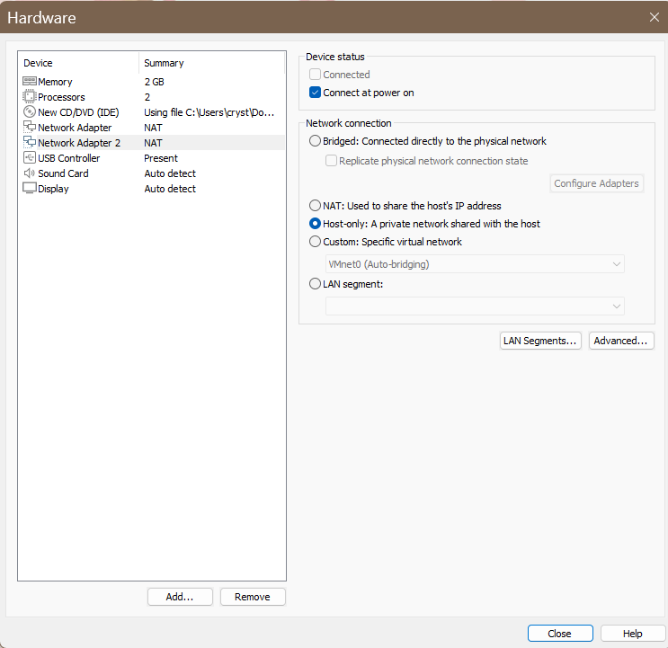

# pfSense-Firewall-Lab
This project demonstrates how I set up a pfSense firewall inside VMware on windows. This lab focuses on building custom firewall rules wit aliases and schedule based policies to simulate real world access control. 

---

## 🧰 Tools Used

- [VMware Workstation Player](https://www.vmware.com/products/desktop-hypervisor/workstation-and-fusion)  
- [pfSense CE 2.7.2 ISO Installer](https://pfsense.org/download/)
- Windows 11 Host Machine
- Command Prompt (Windows)
- pfSense WebGUI 

---

### Step 1: Preparing the Environment

- Verified virtualization support in BIOS/Task Manager.
- Disabled Hyper-V and conflicting services. 
- Downloaded pfSense CE ISO installer and verified checksum.
- Created folders for organization:
  - C:Labs\pfSenseLAb\isos
  - C:Labs\pfSense\Labs\vmx
  - C:Labs\pfSense\screens\

 ---

### Step 2: Creating the pfSense VM:
- Created new VM in VMware workstation pro.  
- Guest OS: **FreeBSD 12 (64-bit)**.  
- Disk: 20GB, single file.  
- Memory: 2GB RAM.  
- CPUs: 2 cores.  
- Network Adapters:  
- Adapter 1 → **NAT** (WAN).  
- Adapter 2 → **Host-only** (LAN).   

<p align="center">
  
</p>


---

### Step 3: Installing pfSense

1. Booted VM from ISO.  
2. Selected **Install pfSense**, accepted defaults.  
3. Partitioned disk with **Auto (UFS) + GPT**.  
4. Installation completed → rebooted.  
5. Disconnected ISO to boot from virtual disk.

**Result:** pfSense Console Menu showed:  
- **WAN (em0)** → `192.168.192.x` (from VMware NAT).  
- **LAN (em1)** → `192.168.1.1/24`.

<p align="center">
  
</p>

---

### Step 4: Connecting Windows Host to pfSense LAN

- Opened **Network Connections (ncpa.cpl)**.  
- Located **VMware Network Adapter VMnet1**.  
- Assigned static IP:  
  - IP: `192.168.1.10`
  - Subnet: `255.255.255.0`
  - Gateway: `192.168.1.1` 
- Tested connectivity to pfSense LAN:  
```bash
ping 192.168.1.1
``` 
✅ **Successful replies**

Accessed pfSense WebGUI:

https://192.168.1.1

Login: admin

Password: pfsense

<p align="center">
  
</p>

---

### 💥 Step 5: Initial WebGUI Setup

Ran through the Setup Wizard:

 - Hostname: pfsense-fw

 - Domain: localdomain

 - DNS: 8.8.8.8, 1.1.1.1

 - Timezone: America/New_York

 - WAN: DHCP (default)

 - LAN: 192.168.1.1/24

 - Changed default admin password

✅ pfSense dashboard now active

<p align="center">
  
</p>

---

### Step 6: Creating Firewall Rules
**Alias**

- Created alias under **Firewall → Aliases → IP**:
  - Name: AllowedHosts
  - Added: 192.168.1.10 (Windows host)

**Rules**

- Allow Rule (LAN → Any)
  - Source: AllowedHosts
  - Action: Pass
  - Description: Allow AllowedHosts out
- Block Rule (LAN → Any)
  - Source: LAN net
  - Action: Block
  - Description: Block all other LAN traffic

**Rule Order**

1. Anti-lockout (default)
2. Allow AllowedHosts
3. Block all others
  
<p align="center">
  
  <br/>
  
</p>

---

### Step 7: 🛡️ Testing Firewall Rules

**Test 1: Allowed Host** (192.168.1.10)

```bash
ping 8.8.8.8
```

✅ Success – replies received
```bash
tracert 8.8.8.8
```

✅ First hop = 192.168.1.1 (pfSense), proving firewall is in the path
```https
https://google.com
```
✅ **Browser loads normally**

**Test 2: Blocked Host**(192.168.1.20)
- Changed Windows adapter to IP 192.168.1.20
```bash
ping 8.8.8.8
```
❌ **Request timed out – blocked**
```bash
tracert 8.8.8.8
```
❌ **No response – traffic blocked by pfSense**
```https
https://google.com
```
❌ **Browser fails to load**

<p align="center">
  
</p>

<p align="center">
  
</p>

<p align="center">
  
</p>
---

### Step 8: Adding a Schedule

- Created schedule under Firewall → Schedules:
  - Name: WorkHours
  - Time: Mon–Fri, 09:00–17:00

- Edited the Allow Rule:
  - Applied WorkHours schedule
    
- Saved and applied changes

<p align="center">
  
</p>

<p align="center">
  
</p>

---

### Step 9: Testing Schedule 

Test 3: Allowed During WorkHours
- Temporarily adjusted schedule to current hour
```bash
ping 8.8.8.8
```
✅ **Success – traffic allowed only during schedule window**
```https
https://google.com
```
✅ **Browser loaded successfully.**

Test 4: Blocked Outside WorkHours
- Adjusted schedule to exclude the current hour
```bash
ping 8.8.8.8
```
❌ **Request timed out – blocked.**
```https
https://google.com
```
❌ **Browser failed to load – rule blocked traffic outside schedule.**

---

### Step 10: Validating with Logs
- Opened Status → System Logs → Firewall → Dynamic View.
- Applied filter for source IP 192.168.1.20.
- Re-ran blocked tests.
- Observed logs showing Block entries for packets from disallowed host and time windows.

✅ Confirmed pfSense actively enforced the rules and logged blocked traffic.

---

### Results
- Enforced a default deny LAN policy.
- Allowed only the defined host (192.168.1.10) outbound access.
- Successfully blocked all other LAN clients.
- Restricted access by time of day using schedules.
- Proved enforcement through:
  - ping
  - tracert
  - Browser tests (https://google.com)
  - pfSense firewall logs

---

### Lessons Learned
- Aliases simplify firewall management (scalable to multiple hosts).
- Schedules enable time-based controls for compliance and policy enforcement.
- Rule order (top-to-bottom) is critical in pfSense.
- Dual-homed hosts (e.g., Wi-Fi + VMnet) can bypass firewalls if not isolated → important in real-world environments.
- Always validate with multiple methods (ping, tracert, browser, logs).

---

### Future Enhancements

- Add pfBlockerNG for DNS/IP blacklists (ads, malware).
- Deploy Snort or Suricata IDS/IPS for intrusion detection.
- Spin up additional VMs to simulate a real LAN behind pfSense.
- Forward logs to Splunk/ELK for SOC-style monitoring and alerting.

---
  
## 🙋 Author

Crystal Hicks  
Information Security Analyst  
Linkedin: https://www.linkedin.com/in/crystal-brown333
